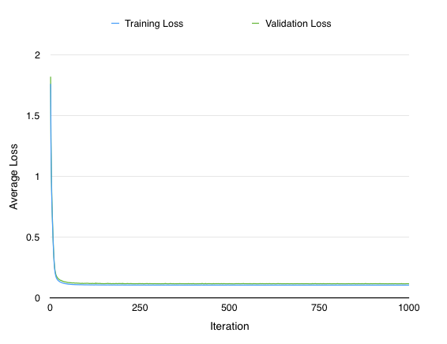
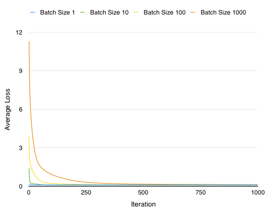
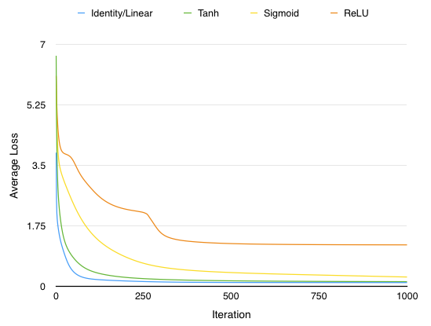
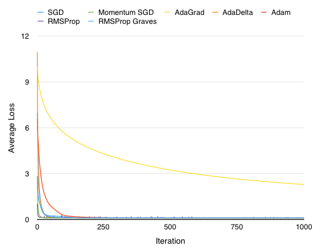

# Autoencoder

An Autoencoder implementation (with AdaGrad) in Python along with a few benchmarks. The code was written for the Preferred Infrastructure / Preferred Networks internship coding assignments in 2016. 

There are a total of five assignments, split into two parts. In the first part, you're only allowed to use the standard libraries to implement an Autoencoder for given 1-dimensional data. In the second part, you may to use any library available to solve the same task, minimizing the loss. In this implementation, we're using the [Chainer](http://chainer.org/) framework. 

The official instructions in Japanese for the assignments can be found at [https://research.preferred.jp/wp-content/uploads/2016/06/intern2016.pdf](https://research.preferred.jp/wp-content/uploads/2016/06/intern2016.pdf). 

## Run

- Environment `Python 3.5.1`
- Dependencies `numpy`, `chainer`


The first four assignments belong to the first part, the fifth assignment to the second.`$ROOT_DIR` refers to the root directory of your cloned repository.

```
cd $ROOT_DIR
python assignment1.py			// Outer product
python assignment2.py			// Affine transformation
python assignment3.py			// One training step
python assignment4.py			// Training lopp
python assignment4_adagrad.py	// Training loop with AdaGrad
python assignment5.py			// Training using Chainer
```

## Results

### Loss

`~0.11` with both our Autoencoder implementation and the Chainer implementation.

Chainer implementation plot results are as follows.







