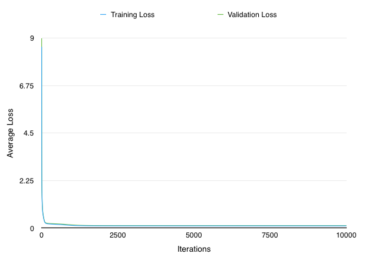

## 2016年 Preferred Infrastructure / Preferred Networks インターン選考コーディング課題

ヤマザキ裕幸ヴインセント hiroyuki.vincent.yamazaki@gmail.com

## 課題５

#### 過学習と交差検定

課題４でのロスは訓練データを用いて計算されたため、過学習を起こしている可能性が高いと考えられました。そこで`dataset.dat`を分割し、半分を訓練用、もう半分をvalidationに使い、イテレーション毎にロスを計算しグラフに表すことで過学習を起こしているかを検証しました。10000イテレーションを回してもvalidation setのロスは増加しなかったので過剰な過学習は起こしてないと考えます。さらに課題４のロスと比較をしやすくするために、課題４と同じく全訓練データを学習、validationに使います。

1000イテレーションで行った実験の結果は以下の通りです。

#### バッチ

バッチのサイズを変えて学習

#### 活性化関数：Identity/Linear, Tanh, Sigmoid, ReLU

#### 学習方法：(Vanilla)SGD, Momentum SGD, AdaGrad, Adam

#### Denoising Autoencoder

#### Dropoutあり・なし

#### 隠れ層のユニット数

問題文にもあるように、隠れ層のユニット数が増えれば学習データのロスは減りますが、最終的には恒等関数を学習してしまう可能性が高いので、未知のデータに対する制度は保証できません。

#### 隠れ層の数

一般的には隠れ層の数は増えるとVanishing Gradient Problem(又はExploding Gradient Problem)を起こしやすくなります。入力層に近い層の重みの学習が止まる、肥大してしまいます。問題は逆伝搬の際に重みの変化が最初の層に近づくにつれて因数が

今回の課題において、学習中のロスを計算するために用いられているValidation SetがTraining Setと全く一緒であるため、過学習（Overfitting）を起こしていると推測することができる。

