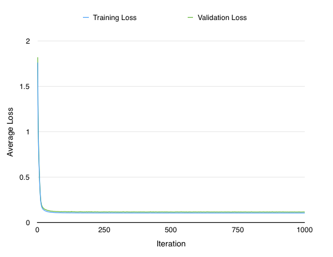
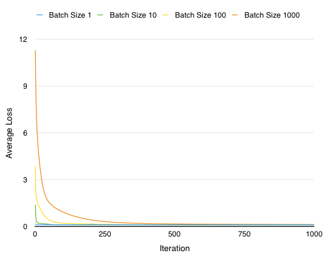
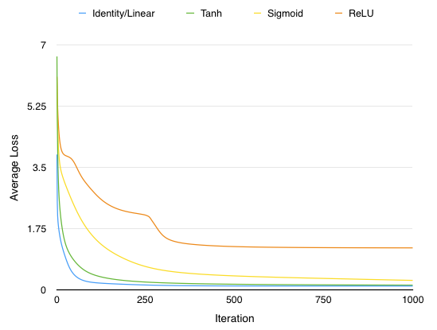
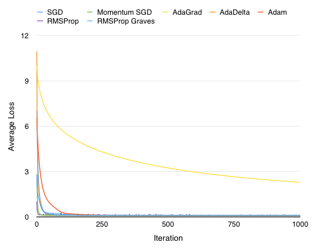

# レポート

ヤマザキ裕幸ヴインセント hiroyuki.vincent.yamazaki@gmail.com

#### 過学習と交差検定

課題４でのロスは訓練データを用いて計算されたため、過学習を起こしている可能性が高いと考えられました。そこで`dataset.dat`を分割し、半分を訓練用、もう半分をvalidationに使い、イテレーション毎にロスを計算しグラフに表すことで過学習を起こしているかを検証しました。1000イテレーションを回してもvalidation setのロスは増加しなかったので過剰な過学習は起こっていないと考えます。考えられるのは、学習の収束が早いこと、もしくは早い段階で学習率が減衰しているということです。下のグラフからもわかるように、極小値が数十回のイテレーションですでに見つかってしまうので、学習率を上げるなどの工夫をして緩やかな学習にします。以上を理由に今回は課題４のロスと比較をしやすくするためもあり全訓練データを学習、validationに使います。イテレーションは、デフォルトで**1000**あれば充分だとみなします。

#### バッチ

毎イテレーション訓練データをランダムにシャッフルして、バッチのサイズを変えた検証が右上のグラフになります。バッチサイズが1の場合はオンラインStochastic Gradient Descent(SGD)学習になります。10、100の場合はSGDミニバッチ方、1000の場合はGradient Descentです。新たな極小値を見つけたいので普通のGradient Descentは採用しないで、学習率の比較的緩い**100**を採用します。

#### 活性化関数：Identity/Linear, Tanh, Sigmoid, ReLU

活性化関数を比べたもの後が左下のグラフです。ReLUのみ学習が不安定なのが分かります。

#### 学習方法：(Vanilla)SGD, Momentum SGD, AdaGrad, Adam

Chainerが提供している学習方法をいくつかデフォルトの値で実装したものが右上のグラフになります。AdaGradの学習が一番遅いのがわかりますが、実際はイテレーション数を増やすとどの手法でも最終的には平均ロスはほぼ同じで約`0.11`です。

#### Denoising Autoencoder

全訓練データで学習、validationを行っているため、過学習を防ぐために用いられるノイズはかえって結果を悪化させてしまいました。交差検定で試しても、ロスは下がりませんでした。10%のmaskノイズ（値を0にする）で`0.333...`の極小値から下がりませんでした。*Dropout*も同じく結果を悪化させてしまいました。

#### 隠れ層のユニット数

問題文にもあるように隠れ層のユニット数が増えれば学習データへ対するロスは減りますが、最終的には恒等関数を学習してしまう可能性があるので未知のデータに対する精度は低下します。100のミニバッチSGDで隠れ層のユニット数を10にすると1000イテレーションで平均ロスは`0.00467...`まで下がります。50ユニットで`0.000176...`でした。ノイズを上げるとロスも上がりました。

#### 隠れ層の数

隠れ層の数が増えるとVanishing Gradient Problem(又はExploding Gradient Problem)を起こしやすくなります。入力層に近い層の重みの学習が進まない、又は肥大してしまう問題です。逆伝搬の際に重みの変化が最初の層に近づくにつれて積の因数（勾配）の数が増えるので重みがうまく学習されません。また、活性化関数が恒等関数等の線形であればAutoencoderは層を増しやしても、一層で同じ学習ができるはずです。

#### 結果

隠れ層のユニットを増やさないかぎり平均ロスは`0.11`までしか減りませんでした。`0.11`の精度を出すモデルのパラメータは`assignment5.py`のソースコードをご参照ください。さらに精度を高めるのであれば、データを理解する必要があります。ちなみに、重み、バイアスの初期値を変えた上でのロスの変動は確認していません。